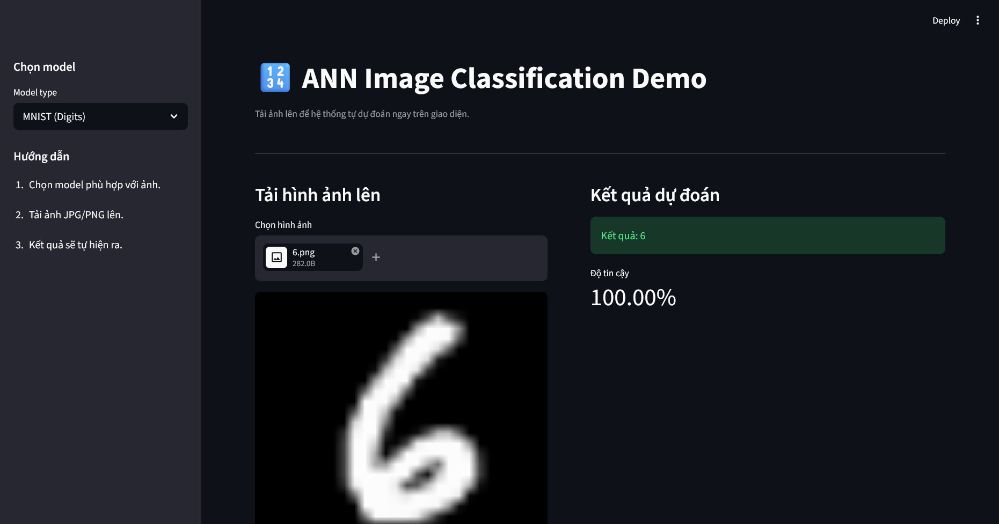
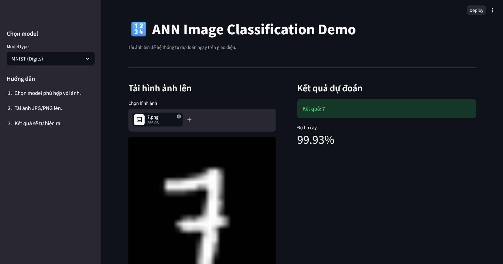
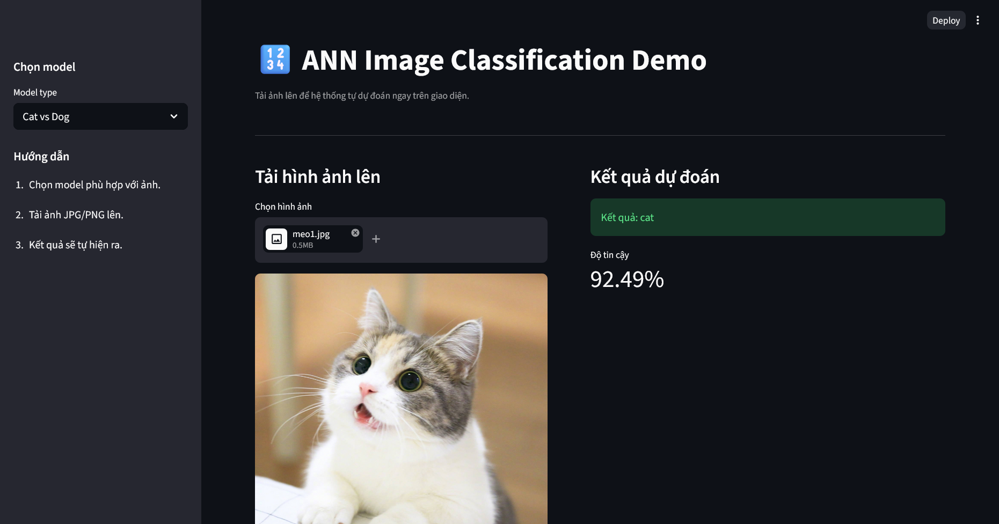
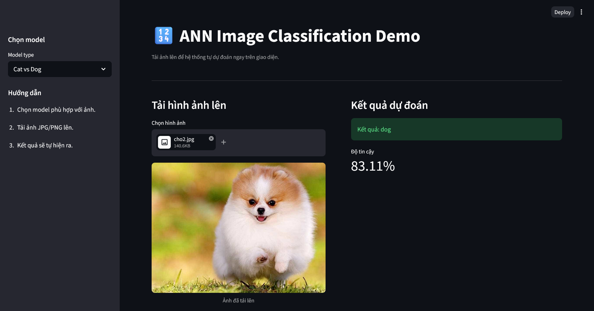
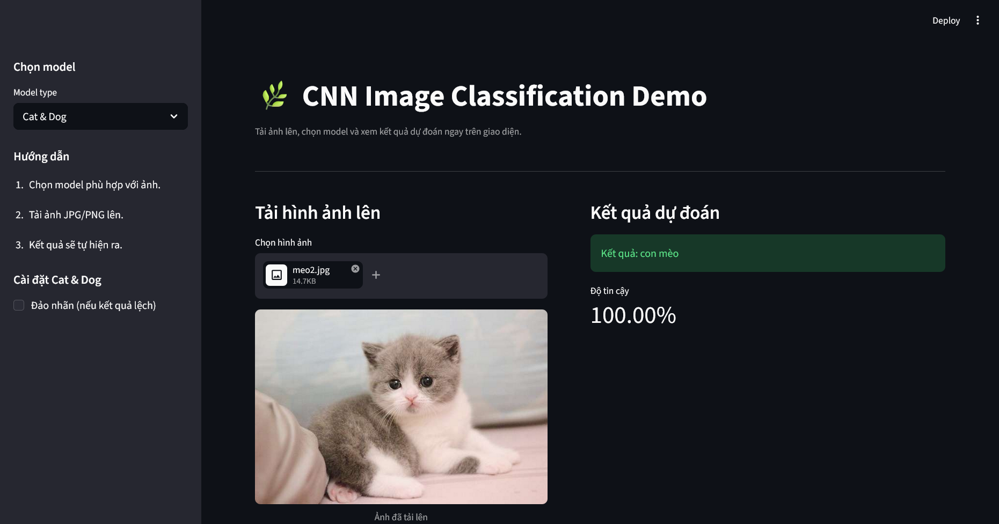
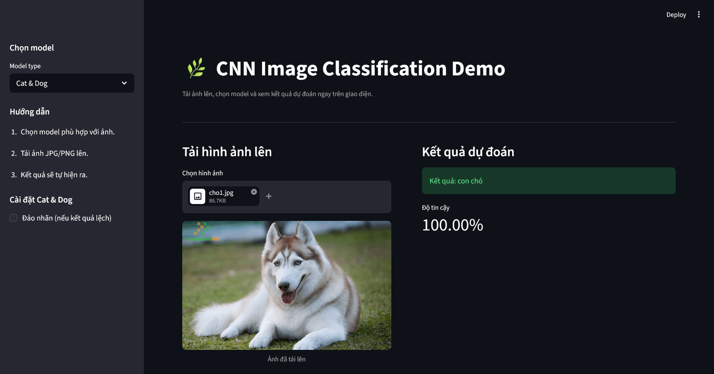
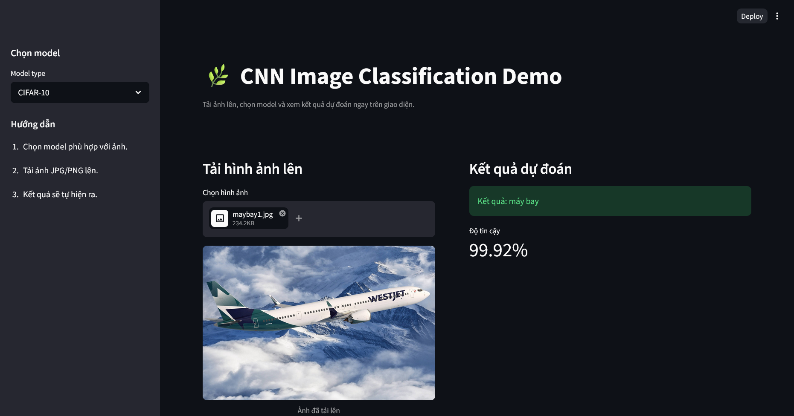
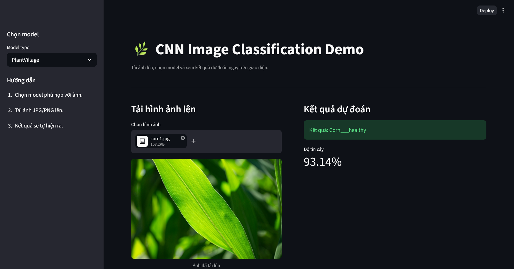
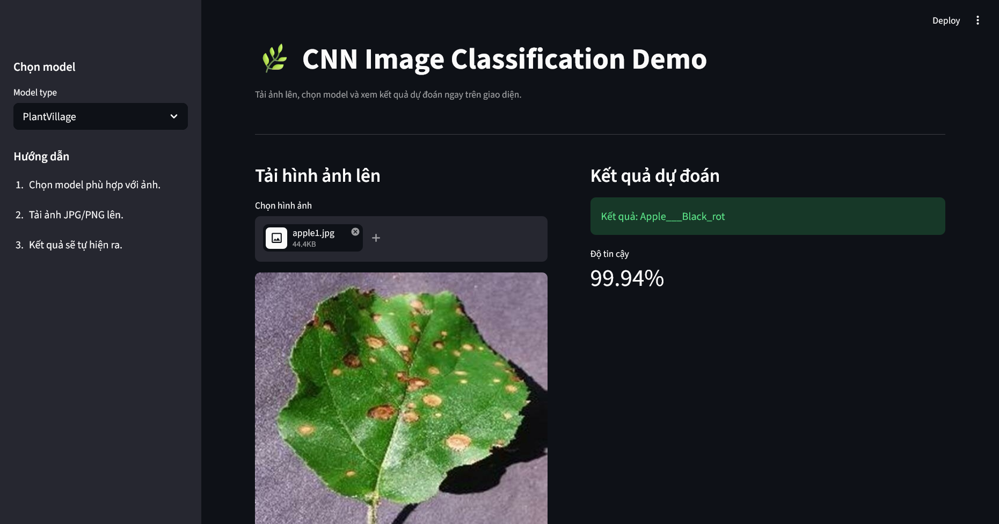
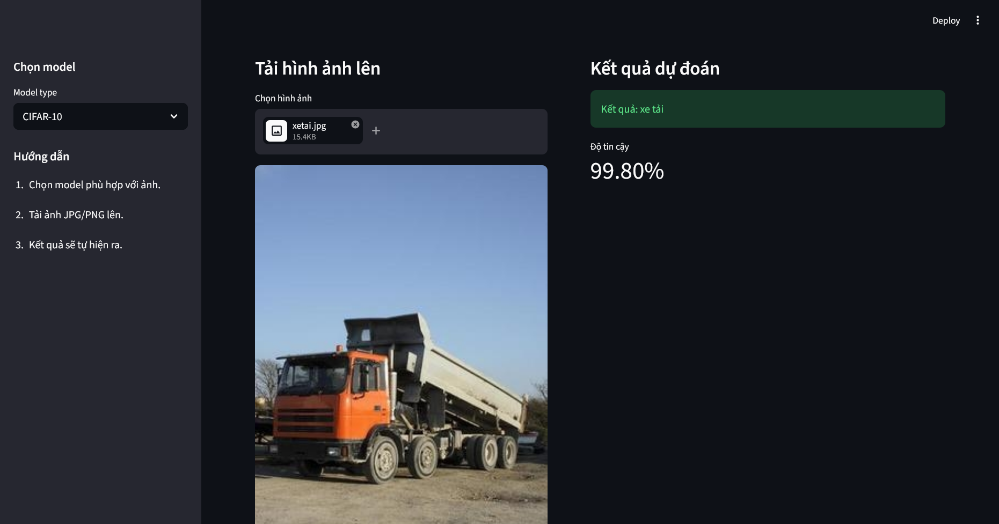

# Kết quả thực hiện bài tập - Image Classification (ANN & CNN)

### Lab 4: Mạng Thần Kinh Nhân tạo (ANN)
- ✔ **MNIST Digits:** Huấn luyện ANN nhận diện chữ số (0-9) với độ chính xác ~97%
- ✔ **Cat vs Dog:** Huấn luyện ANN phân loại mèo vs chó với độ chính xác >80%
- ✔ **Demo App:** Xây dựng ứng dụng Streamlit để dự đoán trực tiếp

### Lab 6: Mạng Nơron Tích chập (CNN)
- ✔ **Cat & Dog CNN:** Huấn luyện CNN phân loại mèo vs chó với độ chính xác >90%
- ✔ **CIFAR-10:** Huấn luyện CNN phân loại 10 loại vật thể với độ chính xác >90%
- ✔ **PlantVillage:** Huấn luyện CNN nhận diện 38 loại bệnh cây trồng với độ chính xác >90%
- ✔ **Multi-model Demo:** Xây dựng ứng dụng Streamlit hỗ trợ 3 mô hình trong 1 ứng dụng

---

## Chạy Demo

### Lab 4 - ANN Demo App
```bash
cd Lab4
streamlit run demo_app.py
```

**Chức năng:** Nhập ảnh để dự đoán bằng mô hình ANN
- MNIST: Nhận diện chữ số 0-9
- Cat vs Dog: Phân loại mèo hoặc chó

### Lab 6 - CNN Demo App (3 mô hình)
```bash
cd Lab6
streamlit run demo_app.py
```

**Chức năng:** Chọn model và nhập ảnh để dự đoán bằng CNN
- Cat & Dog: Phân loại mèo hoặc chó
- CIFAR-10: Phân loại 10 loại vật thể
- PlantVillage: Nhận diện bệnh cây trồng (38 loại)

---

## Demo Images

### ANN - MNIST & Cat vs Dog

<table>
  <tr>
    <td width="50%" align="center">
      <b>Digit 6 Recognition</b><br>
      
    </td>
    <td width="50%" align="center">
      <b>Digit 7 Recognition</b><br>
      
    </td>
  </tr>
  <tr>
    <td width="50%" align="center">
      <b>Cat Detection</b><br>
      
    </td>
    <td width="50%" align="center">
      <b>Dog Detection</b><br>
      
    </td>
  </tr>
</table>

### CNN - Cat & Dog, CIFAR-10, PlantVillage

<table>
  <tr>
    <td width="33%" align="center">
      <b>Cat Classification</b><br>
      
    </td>
    <td width="33%" align="center">
      <b>Dog Classification</b><br>
      
    </td>
    <td width="33%" align="center">
      <b>Airplane Detection</b><br>
      
    </td>
  </tr>
  <tr>
    <td width="33%" align="center">
      <b>Corn Disease Detection</b><br>
      
    </td>
    <td width="33%" align="center">
      <b>Apple Disease Detection</b><br>
      
    </td>
    <td width="33%" align="center">
      <b>Truck Detection</b><br>
      
    </td>
  </tr>
</table>

---

## Kết quả đạt được

### Lab 4 - ANN
| Model | Dataset | Input | Classes | Kết quả |
|-------|---------|-------|---------|---------|
| MNIST | MNIST | 28×28 (784 flat) | 10 | Độ chính xác ~97% |
| Cat vs Dog | Cats vs Dogs | 64×64 (flat) | 2 | Độ chính xác >80% |

### Lab 6 - CNN
| Model | Dataset | Input | Classes | Kết quả |
|-------|---------|-------|---------|---------|
| Cat & Dog | Cats vs Dogs | 224×224 | 2 | Độ chính xác >90% |
| CIFAR-10 | CIFAR-10 | 32×32 | 10 | Độ chính xác >90% |
| PlantVillage | PlantVillage | 128×128 | 38 | Độ chính xác >90% |

---

## Thông tin mô hình

| Mô hình | Framework | Dataset | Input Size | Classes | Accuracy |
|---------|-----------|---------|-----------|---------|----------|
| MNIST ANN | PyTorch | MNIST | 28×28 (784) | 10 | ~97% |
| Cat vs Dog ANN | PyTorch | Cats vs Dogs | 64×64 (flat) | 2 | >80% |
| Cat & Dog CNN | PyTorch | Cats vs Dogs | 224×224 | 2 | >90% |
| CIFAR-10 CNN | PyTorch | CIFAR-10 | 32×32 | 10 | >90% |
| PlantVillage CNN | PyTorch | PlantVillage | 128×128 | 38 | >90% |

---

## Công nghệ sử dụng

- **Framework:** PyTorch (xây dựng mô hình from scratch)
- **Web App:** Streamlit (giao diện người dùng)
- **Xử lý ảnh:** Pillow, torchvision.transforms
- **Python:** 3.8+

---

## Tài liệu tham khảo

- PyTorch Official: https://pytorch.org/
- Streamlit Docs: https://docs.streamlit.io/
- CIFAR-10: https://www.cs.toronto.edu/~kriz/cifar.html
- PlantVillage Dataset: https://github.com/spMohanty/PlantVillage-Classification-Challenge
- MNIST Dataset: http://yann.lecun.com/exdb/mnist/
- Cats vs Dogs: https://huggingface.co/datasets/microsoft/cats_vs_dogs